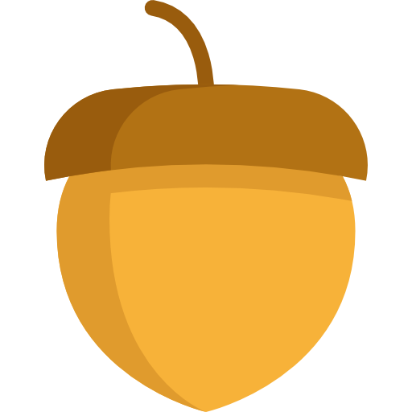

<!DOCTYPE html>

<html>
<head>
	<meta charset="utf-8">
	<title> Clicker </title>
	<link rel="stylesheet" type="text/css" href="style.css">
</head>

<body>

	

			<text id="balance">0</text>
		

	

		

			

				

					<text>желудей <text id="click_earnings"></text> за клик</text>
				

				

					<text>желудей <text id="auto_earnings"></text> в секунду</text>
				

			

		

	
		

			

				<a class="panel_buttons" onclick="shop_menu()">Магазин</a>
				<a class="panel_buttons" onclick="lottery_menu()">Лотерея</a>
			

		

		

	
		
	

	

		

		
		

		<a class="buttons" onclick="main_menu()"><--</a>
	

	

		

			
 Выигрыш в лотерею составит x3 Шанс на выигрыш 40%  

			
<text id="lottery_info"> </text> 

			<a class="buttons" onclick="lottery(500)">Стоимость 0.5 желудей</a>
			<a class="buttons" onclick="lottery(1000)">Стоимость 1 желудь</a>
			<a class="buttons" onclick="lottery(5000)">Стоимость 5 желудей</a>
			<a class="buttons" onclick="lottery(10000)">Стоимость 10 желудей</a>
			<a class="buttons" onclick="lottery(15000)">Стоимость 15 желудей</a>
		

		<a class="buttons" onclick="main_menu()"><--</a>
	

</body>
</html>
